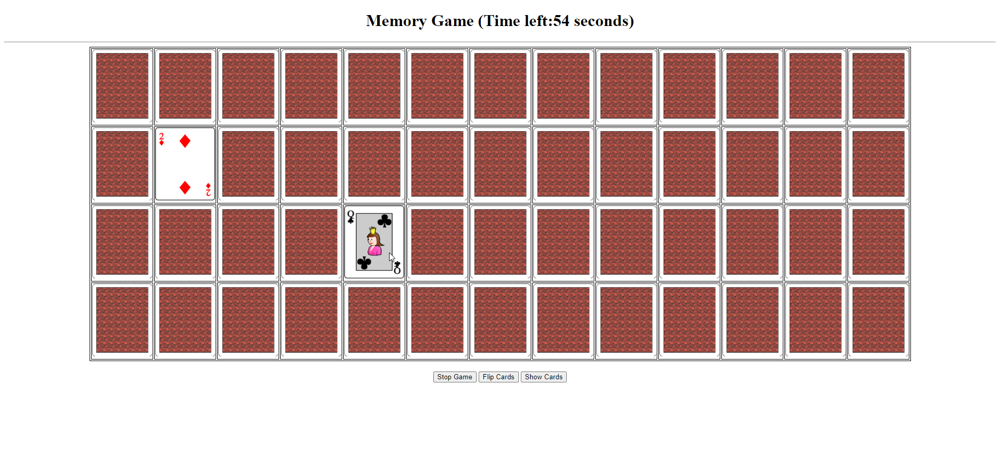
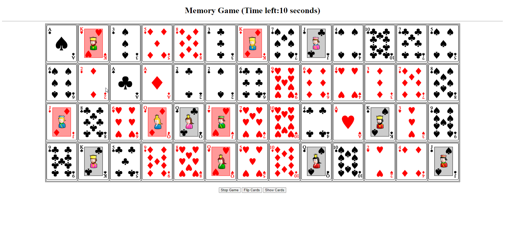
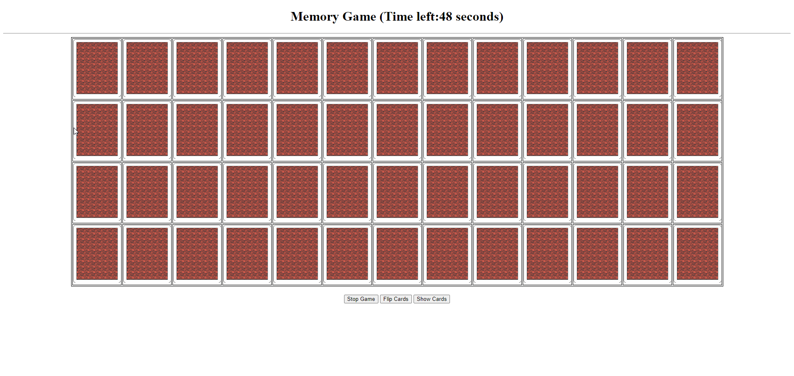

# Memory Game

## Description

The Memory Game is a classic card matching game where players are required to match pairs of cards with identical symbols. It is implemented using HTML, CSS, and JavaScript.

## Features

- Interactive card flipping animation.
- Timer to track the game duration.
- Score tracking based on the number of moves made.
- Win condition detection.
- Responsive design for various screen sizes.

## How to Play

1. **Setup**:
   - Clone the repository or download the project files.
   - Open the `index.html` file in a web browser.

2. **Gameplay**:
   - Click on a card to reveal its symbol.
   - Click on another card to attempt to find a match.
   - If the symbols match, both cards remain face up.
   - If the symbols do not match, both cards flip back face down.
   - Continue flipping cards and matching pairs until all pairs are found.

3. **Winning**:
   - The game ends when all pairs have been successfully matched.
   - A modal appears to congratulate the player and display their score.

## Technologies Used

- HTML5
- CSS3
- JavaScript

## Screenshots

*Gameplay Screenshot*

*Win Screen Screenshot*

## Credits

- Card graphics courtesy of [Flaticon](https://www.flaticon.com/).
- Shuffle algorithm based on the Fisher-Yates shuffle.

## Contributions

Contributions are welcome! If you'd like to contribute to the project, please follow these steps:

1. Fork the repository.
2. Create a new branch (`git checkout -b feature/improvement`).
3. Make your changes.
4. Commit your changes (`git commit -am 'Add new feature'`).
5. Push to the branch (`git push origin feature/improvement`).
6. Create a new Pull Request.

## License

This project is licensed under the MIT License - see the [LICENSE](LICENSE) file for details.
